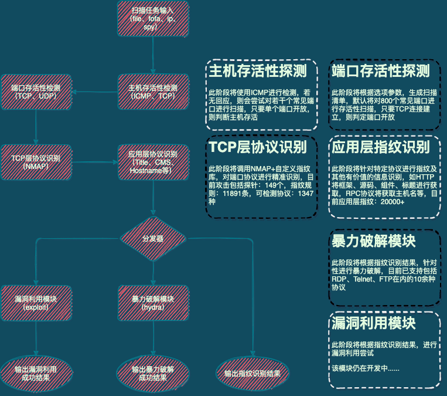
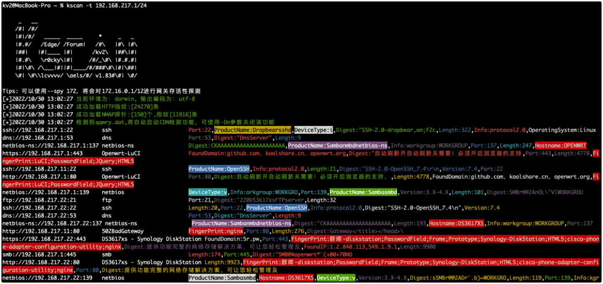
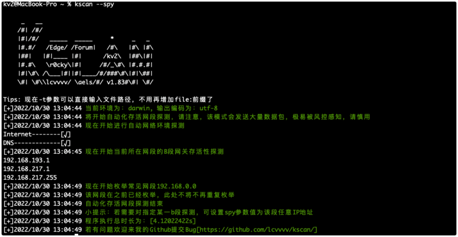
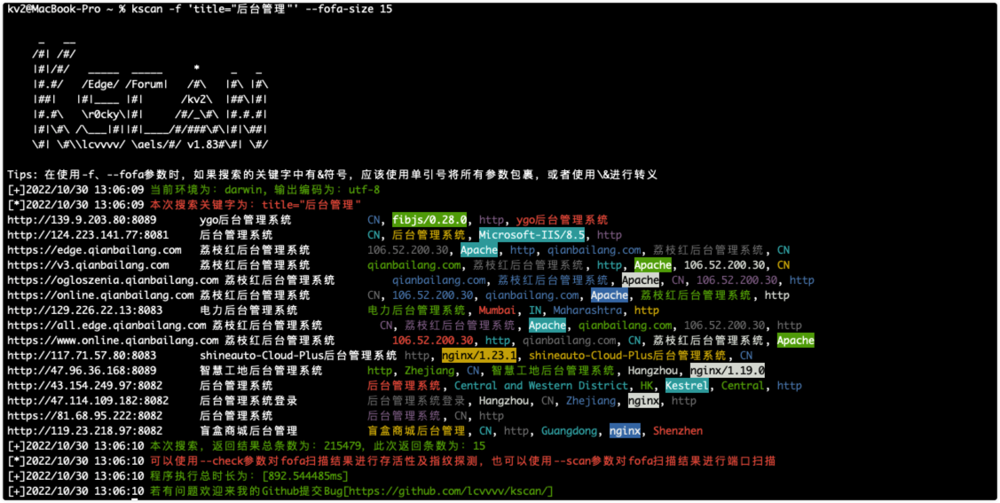
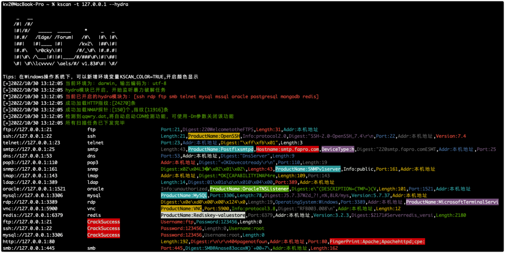
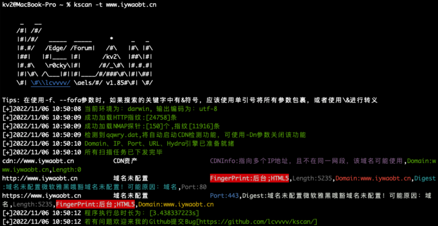

# Kscan-简单的资产测绘工具
<a href="https://github.com/lcvvvv/kscan"></a>
<a href="https://github.com/lcvvvv/kscan"></a>
<a href="https://github.com/lcvvvv/kscan"></a>


 

[[中文 Readme]][url-doczh]
|
[[English Readme]][url-docen]

## 0 免责声明（~~作者没有参加XX行动，别溯了~~）

- 本工具仅面向合法授权的企业安全建设行为与个人学习行为，如您需要测试本工具的可用性，请自行搭建靶机环境。

- 在使用本工具进行检测时，您应确保该行为符合当地的法律法规，并且已经取得了足够的授权。请勿对非授权目标进行扫描。

如果发现上述禁止行为，我们将保留追究您法律责任的权利。

如您在使用本工具的过程中存在任何非法行为，您需自行承担相应后果，我们将不承担任何法律及连带责任。

在安装并使用本工具前，请您务必审慎阅读、充分理解各条款内容。

除非您已充分阅读、完全理解并接受本协议所有条款，否则，请您不要安装并使用本工具。您的使用行为或者您以其他任何明示或者默示方式表示接受本协议的，即视为您已阅读并同意本协议的约束。

## 1 简介

```
     _   __
    /#| /#/   轻量综合扫描工具 by：kv2
    |#|/#/  _____  _____     *     _   _
    |#.#/  /Edge/ /Forum\   /#\   /#\ /#\
    |##|  |#|____ |#|      /Kv2\  |##\|#|
    |#.#\  \r0cky\|#|     /#/_\#\ |#.#.#|
    |#|\#\/\___|#||#|____/#/Rui\#\|#|\##|
    \#| \#\lcvvvv/ \aels/#/ v1.87#\#/ \#/
	
```

Kscan是一款纯go开发的全方位扫描器，具备端口扫描、协议检测、指纹识别，暴力破解等功能。支持协议1200+，协议指纹10000+，应用指纹20000+，暴力破解协议10余种。 

## 2 写在前面

目前类似的资产扫描、指纹识别、漏洞检测的工具其实已经非常多了，也不乏有很棒的工具，但是Kscan其实有很多不同的想法。

- Kscan希望能够接受多种输入格式，无需在使用之前对扫描对象进行分类，比如区分为IP，还是URL地址等，这对于使用者来说无疑是徒增工作量，所有的条目，均能正常输入和识别，若是URL地址，则会保留路径进行检测，若只是IP:PORT，则会优先对该端口进行协议识别。目前Kscan支持三种输入方式（-t,--target|-f,--fofa|--spy）。

- Kscan没有为了追求效率，而根据端口号与常见协议进行比对来确认端口协议，也不是只检测WEB资产，在这方面，Kscan则更加看重准确性和全面性，只有高准确性的协议识别，才能为后续的应用层识别，提供良好的检测条件。

- Kscan不是采用模块化的方式做单纯的功能堆叠，比如某个模块单独获取标题，某个模块单独获取SMB信息等等，独立运行，独立输出，而是以端口为单位输出资产信息，比如端口协议为HTTP，则会自动化进行后续的指纹识别、标题获取，端口协议为RPC，则会尝试获取主机名等等。



## 3 编译手册

[编译手册](https://github.com/lcvvvv/kscan/wiki/%E7%BC%96%E8%AF%91)

## 4 开始吧

Kscan目前具备3种输入目标的方式

- -t/--target 可添加--check参数，只对指定的目标端口进行指纹识别，否则将对目标进行端口扫描和指纹识别

```
IP地址：114.114.114.114
IP地址段：114.114.114.114-115.115.115.115
URL地址：https://www.baidu.com
文件地址：/tmp/target.txt
```

- --spy 可添加--scan参数可对存活C段进行端口扫描和指纹识别，否则将只检测存活的网段

```
[空]：将检测本机IP地址，对本机IP所在B段进行探测
[all]：将对所有私网地址（192.168/172.32/10等）进行探测
IP地址：将对指定IP地址所在B段进行探测
```


- -f/--fofa 可添加--check将对检索结果进行存活性验证，添加--scan参数将对检索结果进行端口扫描和指纹识别，否则将只返回fofa检索结果
```
fofa搜索关键字：将直接返回fofa搜索结果
```

## 5 使用方法

```
usage: kscan [-h,--help,--fofa-syntax] (-t,--target,-f,--fofa,--spy) [-p,--port|--top] [-o,--output] [-oJ] [--proxy] [--threads] [--path] [--host] [--timeout] [-Pn] [-Cn] [-sV] [--check] [--encoding] [--hydra] [hydra options] [fofa options]


optional arguments:
  -h , --help     show this help message and exit
  -f , --fofa     从fofa获取检测对象，需提前配置环境变量:FOFA_EMAIL、FOFA_KEY
  -t , --target   指定探测对象：
                  IP地址：114.114.114.114
                  IP地址段：114.114.114.114/24,不建议子网掩码小于12
                  IP地址段：114.114.114.114-115.115.115.115
                  URL地址：https://www.baidu.com
                  文件地址：file:/tmp/target.txt
  --spy           网段探测模式，此模式下将自动探测主机可达的内网网段可接收参数为：
                  (空)、192、10、172、all、指定IP地址(将探测该IP地址B段存活网关)
  --check         针对目标地址做指纹识别，仅不会进行端口探测
  --scan          将针对--fofa、--spy提供的目标对象，进行端口扫描和指纹识别
  -p , --port     扫描指定端口，默认会扫描TOP400，支持：80,8080,8088-8090
  -eP, --excluded-port 跳过扫描指定的端口，支持：80,8080,8088-8090
  -o , --output   将扫描结果保存到文件
  -oJ             将扫描结果使用json格式保存到文件
  -Pn          	使用此参数后，将不会进行智能存活性探测，现在默认会开启智能存活性探测，提高效率
  -Cn             使用此参数后，控制台输出结果将不会带颜色
  -Dn             使用此参数后，将关闭CDN识别功能
  -sV             使用此参数后，将对所有端口进行全探针探测，此参数极度影响效率，慎用！
  --top           扫描经过筛选处理的常见端口TopX，最高支持1000个，默认为TOP400
  --proxy         设置代理(socks5|socks4|https|http)://IP:Port
  --threads       线程参数,默认线程100,最大值为2048
  --path          指定请求访问的目录，只支持单个目录
  --host          指定所有请求的头部Host值
  --timeout       设置超时时间
  --encoding      设置终端输出编码，可指定为：gb2312、utf-8
  --match         对资产返回banner进行检索，存在关键字的，才会显示，否则不会显示
  --hydra         自动化爆破支持协议：ssh,rdp,ftp,smb,mysql,mssql,oracle,postgresql,mongodb,redis,默认会开启全部
hydra options:
   --hydra-user   自定义hydra爆破用户名:username or user1,user2 or file:username.txt
   --hydra-pass   自定义hydra爆破密码:password or pass1,pass2 or file:password.txt
                  若密码中存在使用逗号的情况，则使用\,进行转义，其他符号无需转义
   --hydra-update 自定义用户名、密码模式，若携带此参数，则为新增模式，会将用户名和密码补充在默认字典后面。否则将替换默认字典。
   --hydra-mod    指定自动化暴力破解模块:rdp or rdp,ssh,smb
fofa options:
   --fofa-syntax  将获取fofa搜索语法说明
   --fofa-size    将设置fofa返回条目数，默认100条
   --fofa-fix-keyword 修饰keyword，该参数中的{}最终会替换成-f参数的值
```

功能不复杂，其他的自行探索

## 6 演示

### 6.1 端口扫描模式



### 6.2 存活网段探测



### 6.3 Fofa结果检索



### 6.4 暴力破解



### 6.5 CDN识别



## 7 特别感谢

- [EdgeSecurityTeam](https://github.com/EdgeSecurityTeam)

- [bufferfly](https://github.com/dr0op/bufferfly)

- [EHole(棱洞)](https://github.com/EdgeSecurityTeam/EHole)

- [NMAP](https://github.com/nmap/nmap/)

- [grdp](https://github.com/tomatome/grdp/)

- [fscan](https://github.com/shadow1ng/fscan)

- [dismap](https://github.com/zhzyker/dismap)

- [nali](https://github.com/zu1k/nali)

## 8 文末

Github项目地址（BUG、需求、规则欢迎提交）: https://github.com/lcvvvv/kscan

[url-doczh]: README.md
[url-docen]: README_ENG.md