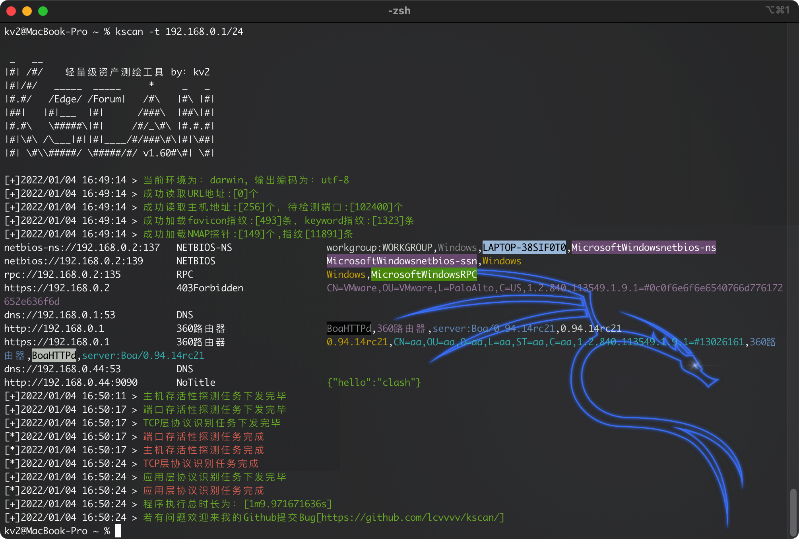
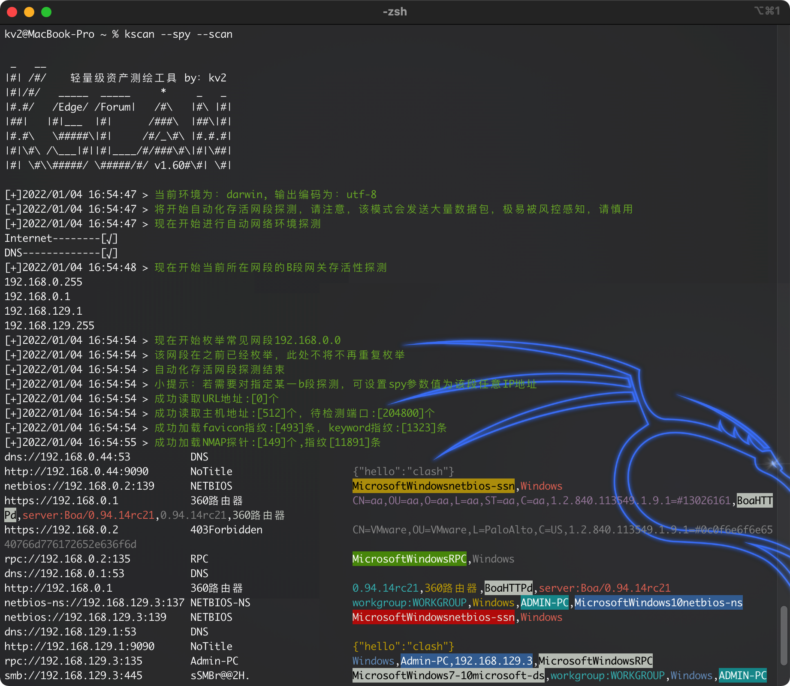
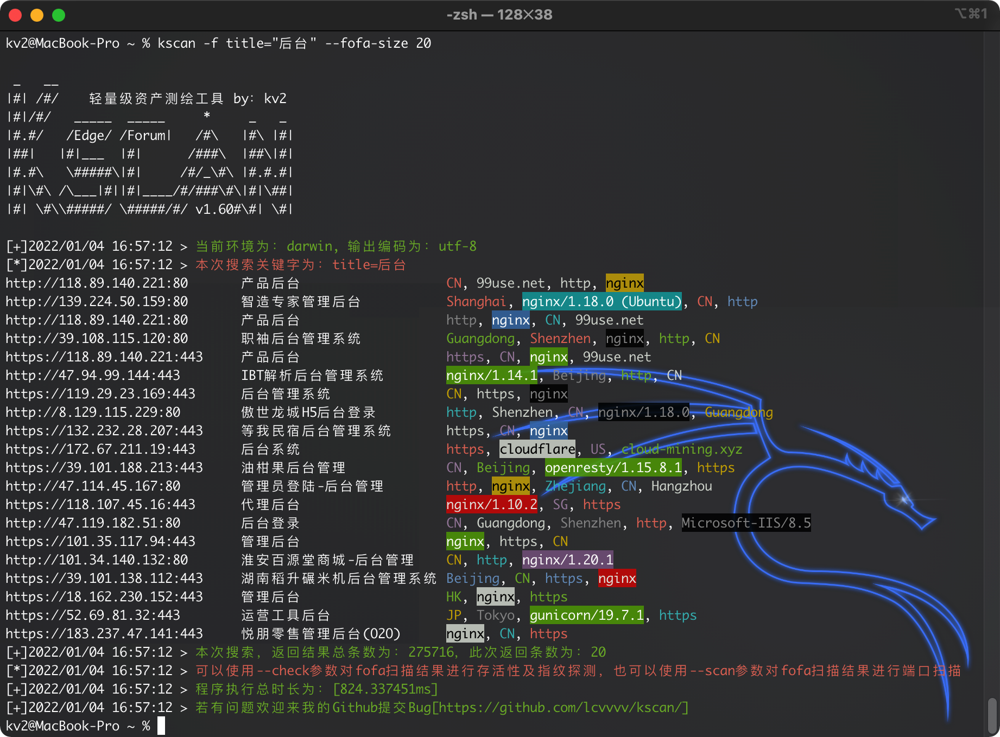
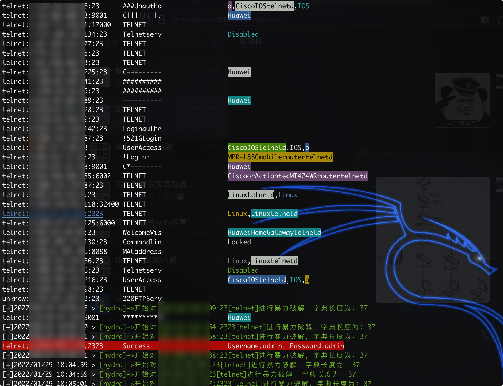

# Kscan-简单的资产测绘工具
<a href="https://github.com/lcvvvv/kscan"></a>
<a href="https://github.com/lcvvvv/kscan"></a>
<a href="https://github.com/lcvvvv/kscan"></a>


 

## 1 简介

```
 _   __
|#| /#/    轻量级资产测绘工具 by：kv2	
|#|/#/   _____  _____     *     _   _
|#.#/   /Edge/ /Forum|   /#\   |#\ |#|
|##|   |#|___  |#|      /###\  |##\|#|
|#.#\   \#####\|#|     /#/_\#\ |#.#.#|
|#|\#\ /\___|#||#|____/#/###\#\|#|\##|
|#| \#\\#####/ \#####/#/     \#\#| \#|
```

kscan是一款资产测绘工具，可针对指定资产进行端口扫描以及TCP指纹识别和Banner抓取，在不发送更多的数据包的情况下尽可能的获取端口更多信息。并能够针对扫描结果进行自动化暴力破解，且是go平台首款开源的RDP暴力破解工具。 

## 2 写在前面

目前类似的资产扫描、指纹识别、漏洞检测的工具其实已经非常多了，也不乏有很棒的工具，但是Kscan其实有很多不同的想法。

- Kscan希望能够接受多种输入格式，无需在使用之前对扫描对象进行分类，比如区分为IP，还是URL地址等，这对于使用者来说无疑是徒增工作量，所有的条目，均能正常输入和识别，若是URL地址，则会保留路径进行检测，若只是IP:PORT，则会优先对该端口进行协议识别。目前Kscan支持三种输入方式（-t,--target|-f,--fofa|--spy）。

- Kscan没有为了追求效率，而根据端口号与常见协议进行比对来确认端口协议，也不是只检测WEB资产，在这方面，Kscan则更加看重准确性和全面性，只有高准确性的协议识别，才能为后续的应用层识别，提供良好的检测条件。

- Kscan不是采用模块化的方式做单纯的功能堆叠，比如某个模块单独获取标题，某个模块单独获取SMB信息等等，独立运行，独立输出，而是以端口为单位输出资产信息，比如端口协议为HTTP，则会自动化进行后续的指纹识别、标题获取，端口协议为RPC，则会尝试获取主机名等等。


## 3 开始吧

Kscan目前具备3种输入目标的方式

- -t/--target 可添加--check参数，只对指定的目标端口进行指纹识别，否则将对目标进行端口扫描和指纹识别

```
IP地址：114.114.114.114
IP地址段：114.114.114.114-115.115.115.115
URL地址：https://www.baidu.com
文件地址：file:/tmp/target.txt
```

- --spy 可添加--scan参数可对存活C段进行端口扫描和指纹识别，否则将只检测存活的网段

```
[空]：将检测本机IP地址，对本机IP所在B段进行探测
[all]：将对所有私网地址（192.168/172.32/10等）进行探测
IP地址：将对指定IP地址所在B段进行探测
```


- -f/--fofa 可添加--check将对检索结果进行存活性验证，添加--scan参数将对检索结果进行端口扫描和指纹识别，否则将只返回fofa检索结果
```
fofa搜索关键字：将直接返回fofa搜索结果
```

## 4、使用方法

```
usage: kscan [-h,--help,--fofa-syntax] (-t,--target,-f,--fofa,--touch,--spy) [-p,--port|--top] [-o,--output] [-oJ] [--proxy] [--threads] [--path] [--host] [--timeout] [-Pn] [-Cn] [--check] [--encoding] [--hydra] [hydra options] [fofa options]


optional arguments:
  -h , --help     show this help message and exit
  -f , --fofa     从fofa获取检测对象，需提前配置环境变量:FOFA_EMAIL、FOFA_TOKEN
  -t , --target   指定探测对象：
                  IP地址：114.114.114.114
                  IP地址段：114.114.114.114/24,不建议子网掩码小于12
                  IP地址段：114.114.114.114-115.115.115.115
                  URL地址：https://www.baidu.com
                  文件地址：file:/tmp/target.txt
  --spy           网段探测模式，此模式下将自动探测主机可达的内网网段可接收参数为：
                  (空)、192、10、172、all、指定IP地址(将探测该IP地址B段存活网关)
  --check         针对目标地址做指纹识别，仅不会进行端口探测
  --scan          将针对--fofa、--spy提供的目标对象，进行端口扫描和指纹识别
  --touch         获取指定端口返回包，可以使用此次参数获取返回包，完善指纹库，格式为：IP:PORT
  -p , --port     扫描指定端口，默认会扫描TOP400，支持：80,8080,8088-8090
  -o , --output   将扫描结果保存到文件
  -oJ             将扫描结果使用json格式保存到文件
  -Pn          	  使用此参数后，将不会进行智能存活性探测，现在默认会开启智能存活性探测，提高效率
  -Cn             使用此参数后，控制台输出结果将不会带颜色。
  --top           扫描经过筛选处理的常见端口TopX，最高支持1000个，默认为TOP400
  --proxy         设置代理(socks5|socks4|https|http)://IP:Port
  --threads       线程参数,默认线程100,最大值为2048
  --path          指定请求访问的目录，只支持单个目录
  --host          指定所有请求的头部Host值
  --timeout       设置超时时间
  --encoding      设置终端输出编码，可指定为：gb2312、utf-8
  --hydra         自动化爆破支持协议：ssh,rdp,ftp,smb,mysql,mssql,oracle,postgresql,mongodb,redis,默认会开启全部
hydra options:
   --hydra-user   自定义hydra爆破用户名:username or user1,user2 or file:username.txt
   --hydra-pass   自定义hydra爆破密码:password or pass1,pass2 or file:password.txt
                  若密码中存在使用逗号的情况，则使用\,进行转义，其他符号无需转义
   --hydra-update 自定义用户名、密码模式，若携带此参数，则为新增模式，会将用户名和密码补充在默认字典后面。否则将替换默认字典。
   --hydra-mod    指定自动化暴力破解模块:rdp or rdp,ssh,smb
fofa options:
   --fofa-syntax  将获取fofa搜索语法说明
   --fofa-size    将设置fofa返回条目数，默认100条
   --fofa-fix-keyword 修饰keyword，该参数中的{}最终会替换成-f参数的值
```

功能不复杂，其他的自行探索

## 5 演示

### 5.1 端口扫描模式



### 5.2 存活网段探测



### 5.3 Fofa结果检索



### 5.3 暴力破解




## 6 特别感谢

- [EdgeSecurityTeam](https://github.com/EdgeSecurityTeam)

- [bufferfly](https://github.com/dr0op/bufferfly)

- [EHole(棱洞)](https://github.com/EdgeSecurityTeam/EHole)

- [NMAP](https://github.com/nmap/nmap/)

- [grdp](https://github.com/tomatome/grdp/)

- [fscan](https://github.com/shadow1ng/fscan)

## 7 文末

Github项目地址（BUG、需求、规则欢迎提交）: https://github.com/lcvvvv/kscan