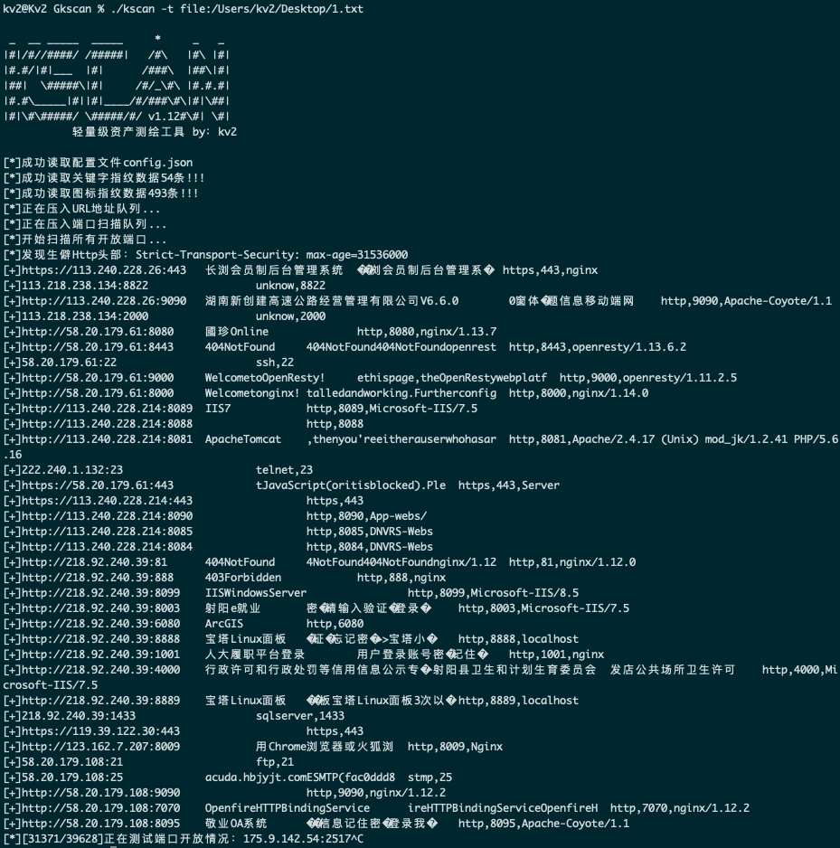

# Kscan-简单好用的资产测绘工具

## 一、简介

```

██╗  ██╗███████╗ ██████╗ █████╗ ███╗   ██╗
██║ ██╔╝██╔════╝██╔════╝██╔══██╗████╗  ██║
█████╔╝ ███████╗██║     ███████║██╔██╗ ██║
██╔═██╗ ╚════██║██║     ██╔══██║██║╚██╗██║
██║  ██╗███████║╚██████╗██║  ██║██║ ╚████║
╚═╝  ╚═╝╚══════╝ ╚═════╝╚═╝  ╚═╝╚═╝  ╚═══╝

```

Kscan从初次发布至今经历了很多个版本，首次发布于吐司，姑且就叫她1.0吧：

https://www.t00ls.net/thread-57634-1-1.html

而后呢，发布了1.5版本首发于棱角，对之前的代码进行了重构：

https://forum.ywhack.com/viewthread.php?tid=114928

原本造这个轮子的初衷是为了解决平时自己护网大面积的寻找薄弱资产问题，最开始的雏形也只具备HTTP关键字（标题、Header）探测功能，现在的版本新增TCP端口的banner识别，以及HTTP、HTTPS的指纹识别功能。在这里也感谢EHole(棱洞)提供的指纹信息。

现在这个版本的kscan使用go编写，实际上前人已经提供了很多具备相似功能的工具了，但是最终我还是坚定心思，写一款自己的工具。

## 二、碎碎念

在开始正式介绍kscan之前，我决定聊一聊有关渗透过程过程中最重要的信息收集阶段：资产发现。


如上图所示，从提供攻击目标，到最终实施攻击，经历了四个关键阶段。

- 转换阶段

  这部分阶段主要目标是完成：从攻击目标到信息资产的一个转换，例如从一个关键字、主域名到具体的IP地址或者其他引申的子域名，主要手段是通过FOFA、钟馗之眼、子域名挖掘/爆破工具来生成一个模糊的清单用于后续阶段去做深层次的筛选。

  其实EHole、Glass等工具有做这一个阶段的整合，但是在这方面，我没有把这个功能做到kscan中，目前我其实是刻意把转换阶段独立出来的。因为在这个阶段，不论是搜索的关键字也好，还是通过域名找到真实IP也好，还是其实更多的需要”人“来做识别。识别完成之后，再生成一个清单给kscan，这样会使后面的流程更高效。

  当然这只是我的个人的一个执念，如果后续反响强烈的话，加进去其实也未尝不可。

- 扫描阶段

  这一阶段主要是针对IP进行端口扫描以便于后续的应用层识别，扫描速率达标的工具诸如：s.exe、masscan等大都只能实现对开放情况进行探测。而目前的大部分工具，把这部分工作交给了FOFA等搜索引擎，不会自己进行资产探测，这样的优点是不会有大量的端口探测包打草惊蛇，缺点是存在时效性。可能漏掉资产。权衡之后，最终还是把这块功能整合到了kscan中，毕竟IP被封了可以换，资产漏掉了可就是真的漏掉了。

- 识别阶段

  这一阶段就是对已开放的端口进行深度的端口识别，传统工具大都是只能对端口开放情况进行探测，各别具备识别功能的工具如：nmap效率则是硬伤，而且不能对内容进行解析，无法获取标题等。又或者只能进行HTTP等特定协议进行识别。为了解决这些问题，kscan在确保效率、不发送更多数据包的前提下，能够识别大多数开放端口的协议。

- 检测阶段

  最后一个阶段，就是应用层检测了，类似CMS指纹识别、敏感目录/文件探测等等，kscan的开发初衷是在不发送更多数据的情况下更多的获取目标的信息，所以不会进行更深层次的目录扫描、指纹比对。但是会进行ico文件hash比对以及首页关键字比对，和返回包头部比对。这其实基本可以满足大部分的指纹识别需求了。

## 三、使用方法

鄙人是一个懒人，所以在写工具的时候也往易用性上进行了更多的考量

```
usage: kscan [-h,--help] (-t,--target) [-p,--port|--top] [-o,--output] [--proxy] [--threads] [--http-code] [--path] [--host] [--timeout]

optional arguments:
  -h , --help     show this help message and exit
  -t , --target   直接扫描指定对象,支持IP、URL、IP/[16-32]、file:/tmp/target.txt
  -p , --port     扫描指定端口，默认会扫描TOP400，支持：80,8080,8088-8090
  -o , --output   将扫描结果保存到文件
  --top           扫描WooYun统计开放端口前x个，最高支持1000个
  --proxy         设置代理{socks5/socks4/https/http}://IP:port
  --threads       线程参数,默认线程4000
  --http-code     指定会记录的HTTP状态码，逗号分割,默认会记录200,301,302,403,404
  --path          指定请求访问的目录，逗号分割，慎用！
  --host          指定所有请求的头部HOSTS值，慎用！
  --timeout       设置超时时间，默认3秒钟，单位为秒！
```

命令很简单相信举几个例子你们都会用

```bash
example：	kscan -t www.baidu.com
#你可以直接输入域名
example：	kscan -t http://www.baidu.com/1.asp
#你也可以直接输入URL地址
example：	kscan -t 114.114.114.114
#你还可以直接输入IP地址
example：	kscan -t 114.114.114.114/24
#你当然也可以直接输入IP+掩码
example：	kscan -t file:/tmp/target.txt
#你亦可以从文件导入,你甚至文件里面还可以嵌套文件
#其他命令都是一些修饰命令，相信聪明的你们都会用啦~~~
```

## 四、演示



## 五、特别感谢

- [EdgeSecurityTeam](https://github.com/EdgeSecurityTeam)

- [bufferfly](https://github.com/dr0op/bufferfly)

- [EHole(棱洞)](https://github.com/EdgeSecurityTeam/EHole)

## 六、更新日志

- 2021年02月26日11:27:20 
  
  修复GBK乱码的问题
  
  变更httpStatusCode的检测逻辑，现在默认会记录所有状态码
  
  


## 七、文末

Github项目地址（BUG、需求、规则欢迎提交）: https://github.com/lcvvvv/kscan


