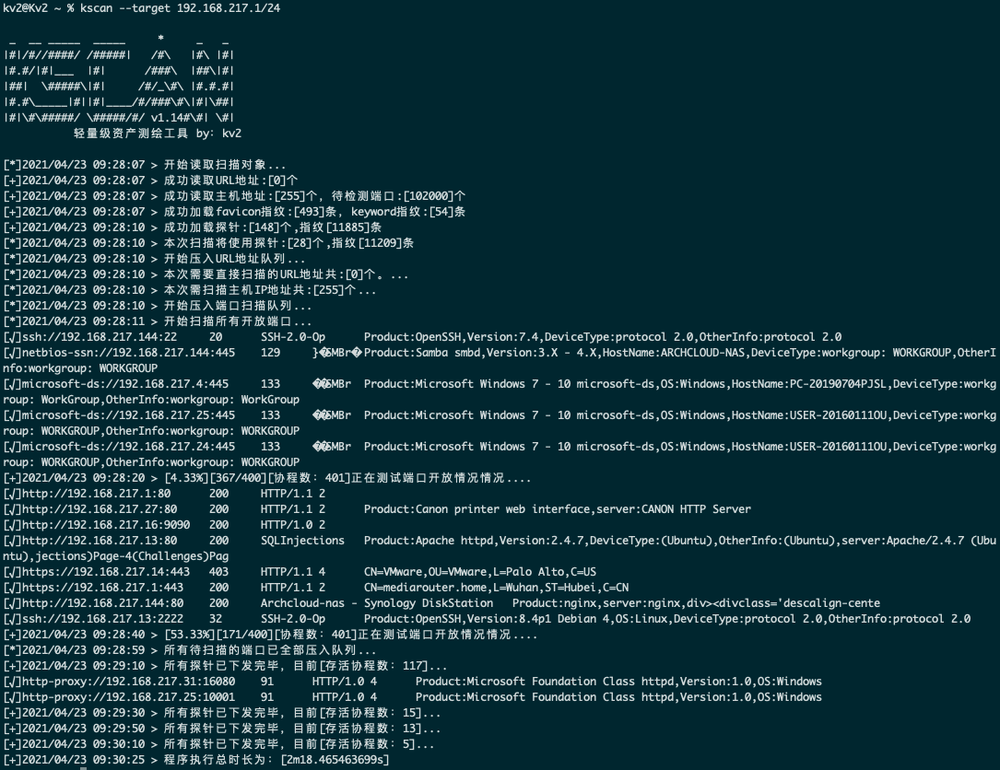
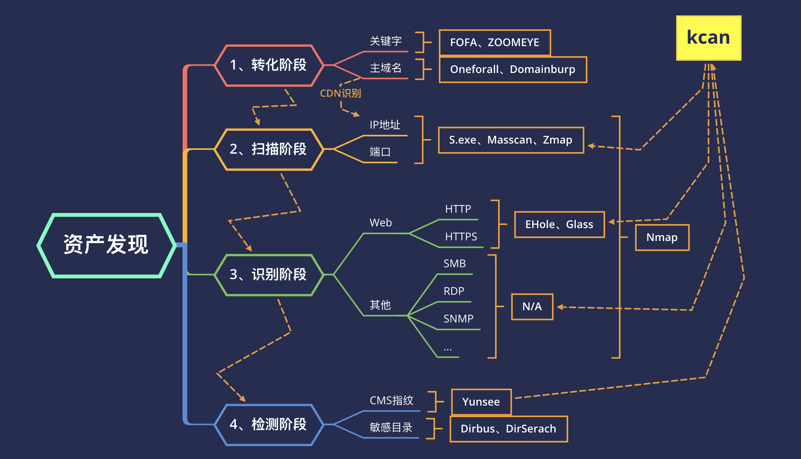

# Kscan-简单好用的资产测绘工具

## 一、简介

```
 _  __ _____  _____     *     _   _
|#|/#//####/ /#####|   /#\   |#\ |#|
|#.#/|#|___  |#|      /###\  |##\|#|
|##|  \#####\|#|     /#/_\#\ |#.#.#|
|#.#\_____|#||#|____/#/###\#\|#|\##|
|#|\#\#####/ \#####/#/ v1.14#\#| \#|

```

原本造这个轮子的初衷是为了解决平时自己护网大面积的寻找薄弱资产问题，最开始的雏形也只具备HTTP关键字（标题、Header）探测功能，现在的版本新增TCP端口的banner识别，以及HTTP、HTTPS的指纹识别功能。在这里也感谢EHole(棱洞)和NMAP提供的指纹信息。

经过一段时间的使用~~主要是一次护网~~和各路大神的反馈，对现有功能进行了部分删减和新增。大致上来说功能是更强大了的。

## 二、更新日志

- 2021年04月23日09:09:35   发布v1.14
  
  [+]新增NMAP指纹识别功能，针对TCP端口的协议识别更为精准了，而且能够截取部分关键信息，比如SMB协议现在除了可以识别端口类型，也可以获取主机名了
  
  [+]新增HTTPS证书识别功能，针对使用HTTPS协议的端口，现在能够获取证书的使用人、域名等等，在做资产测绘的时候更利于确认目标资产
  
  [+]新增--ping参数，若启用该参数，扫描端口之前会先进行Ping探测，若不存活，则不会进行端口扫描。便于提高内网环境做资产测绘的扫描效率。
  
  [+]新增扫描耗时统计功能，现在在扫描程序正常结束的时候会显示，扫描消耗的总时长。
  
  [*]不完美解决中文乱码问题，针对部分使用gbk的协议进行编码转换，然后优化了摘要信息获取逻辑。但是在Windows终端下面还是可能会有乱码。
  
  [*]优化了端口开放的检测逻辑，原本在部分目标有硬防的时候会存在所有端口都打开的情况，现在不会出现这种情况了。但是也有可能会漏掉部分是用生僻协议的端口。~~这里主要特指发送所有探针之后仍然没有回复的端口，这种端口即便开放了，也没没有检测的必要吧，笑~~。
  
  [*]现在Timeout参数的默认为NMAP内置的探针超时时间，建议不要修改。
  
  [-]现在删除掉了原来的底部进度条显示功能，因为这个功能会带来一些意想不到的显示bug，现在使用定时打印进度的方式来显示扫描进度。
  
  [-]效率相对于以前有了些微的下降。但是对于正常使用来说，基本上是够用了。暂时也没有特别好的办法去解决，毕竟效率和准确度这两个东西是互斥的。
  
  [-]现版本依然没有加入fofa搜索的功能，之前的一直没有加入的原因是觉得这个功能耦合度不高，但是现在有了一个大概的思路。后续会尽快加入。


- 2021年02月26日11:27:20 
  
  [*]修复GBK乱码的问题
  
  [*]变更httpStatusCode的检测逻辑，现在默认会记录所有状态码
  

## 三、使用方法

鄙人是一个懒人，所以在写工具的时候也往易用性上进行了更多的考量

```
usage: kscan [-h,--help] (-t,--target) [-p,--port|--top] [-o,--output]
 [--proxy] [--threads] [--path] [--host] [--timeout] [--ping]


optional arguments:
  -h , --help     show this help message and exit
  --ping          在扫描端口之前会先进行Ping探测，若不存活，则不会进行端口扫描
  -t , --target   指定探测对象：
                  IP地址：114.114.114.114
                  IP地址段：114.114.114.114/24,不建议子网掩码小于12
                  URL地址：https://www.baidu.com
                  文件地址：file:/tmp/target.txt
  -p , --port     扫描指定端口，默认会扫描TOP400，支持：80,8080,8088-8090
  -o , --output   将扫描结果保存到文件
  --top           扫描WooYun统计开放端口前x个，最高支持1000个
  --proxy         设置代理(socks5|socks4|https|http)://IP:Port
  --threads       线程参数,默认线程400,最大值为2048
  --path          指定请求访问的目录，逗号分割，慎用！
  --host          指定所有请求的头部HOSTS值，慎用！
  --timeout       设置超时时间，默认为预设的探针超时时间！
```

功能不复杂，其他的自行探索

## 四、演示




## 五、碎碎念

在开始正式介绍kscan之前，我决定聊一聊有关渗透过程过程中最重要的信息收集阶段：资产发现。



如上图所示，从提供攻击目标，到最终实施攻击，经历了四个关键阶段。

- 转换阶段

  这部分阶段主要目标是完成：从攻击目标到信息资产的一个转换，例如从一个关键字、主域名到具体的IP地址或者其他引申的子域名，主要手段是通过FOFA、钟馗之眼、子域名挖掘/爆破工具来生成一个模糊的清单用于后续阶段去做深层次的筛选。

  其实EHole、Glass等工具有做这一个阶段的整合，但是在这方面，我没有把这个功能做到kscan中，目前我其实是刻意把转换阶段独立出来的。因为在这个阶段，不论是搜索的关键字也好，还是通过域名找到真实IP也好，还是其实更多的需要”人“来做识别。识别完成之后，再生成一个清单给kscan，这样会使后面的流程更高效。

  当然这只是我的个人的一个执念，如果后续反响强烈的话，加进去其实也未尝不可。

- 扫描阶段

  这一阶段主要是针对IP进行端口扫描以便于后续的应用层识别，扫描速率达标的工具诸如：s.exe、masscan等大都只能实现对开放情况进行探测。而目前的大部分工具，把这部分工作交给了FOFA等搜索引擎，不会自己进行资产探测，这样的优点是不会有大量的端口探测包打草惊蛇，缺点是存在时效性。可能漏掉资产。权衡之后，最终还是把这块功能整合到了kscan中，毕竟IP被封了可以换，资产漏掉了可就是真的漏掉了。

- 识别阶段

  这一阶段就是对已开放的端口进行深度的端口识别，传统工具大都是只能对端口开放情况进行探测，各别具备识别功能的工具如：nmap效率则是硬伤，而且不能对内容进行解析，无法获取标题等。又或者只能进行HTTP等特定协议进行识别。为了解决这些问题，kscan在确保效率、不发送更多数据包的前提下，能够识别大多数开放端口的协议。

- 检测阶段

  最后一个阶段，就是应用层检测了，类似CMS指纹识别、敏感目录/文件探测等等，kscan的开发初衷是在不发送更多数据的情况下更多的获取目标的信息，所以不会进行更深层次的目录扫描、指纹比对。但是会进行ico文件hash比对以及首页关键字比对，和返回包头部比对。这其实基本可以满足大部分的指纹识别需求了。

## 六、特别感谢

- [EdgeSecurityTeam](https://github.com/EdgeSecurityTeam)

- [bufferfly](https://github.com/dr0op/bufferfly)

- [EHole(棱洞)](https://github.com/EdgeSecurityTeam/EHole)

- [NMAP](https://github.com/nmap/nmap/)

## 七、文末

Github项目地址（BUG、需求、规则欢迎提交）: https://github.com/lcvvvv/kscan


## 八、下载地址

[kscan](https://github.com/lcvvvv/kscan/releases)